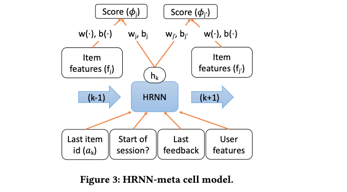

# AIPI 531: HW #3 Build product recommenders for E-commerce
Yuanjing Zhu

November 16, 2023

## Objectives 

1.	Train different session (contextual, sequential) based product recommendation recommenders for E-commerce use cases and compare the performances of the recommenders.
2.	Include item and/or user features as side information for cold items/users.

## Data

The [RailRocket dataset](https://www.kaggle.com/datasets/retailrocket/ecommerce-dataset) was originally used as part of a recommender system competition on Kaggle. It contains user interactions on an e-commerce website within a time frame of 4.5 months. The dataset is typically used for behavior analysis, user segmentation, and implementing recommender systems, which are essential in understanding customer patterns and improving sales strategies.

The dataset consists of three files: a file with behaviour data (events.csv), a file with item properties (item_properties.сsv) and a file, which describes category tree (category_tree.сsv). 


## Methods

### One hot encoding item features: 
To get the item_properties.csv data ready for machine learning, I first combine all the item details we need and clean them up. This means any items that aren't in the user interaction data are taken out and any duplicates are also removed. I also make sure to filter out items that are not currently available for purchase. Then, I pick out the most common item properties to focus on. After that, these properties are turned into a simple format where each item is represented by a line of 0s and 1s: a '1' means the item has that feature, and a '0' means it doesn't. This way, a clear dataframe that shows which items have which features is ready for further analysis and to feed into algorithms that can learn from this data. The notebook is [RR_OneHotEncoding_Features.ipynb](https://github.com/YZhu0225/AIPI531_Deep_Reinforcement_Learning/blob/main/HW_3/RR_OneHotEncoding_Features.ipynb) and the one hot encoded top 500 item features are stored in [item_features.csv](https://drive.google.com/file/d/1SDzZmzSytammXWBbPqSGl49DpQB8IzF4/view?usp=drive_link)

### Vanilla DRL recommenders
The open-source code implementation from [Xin Xin](https://drive.google.com/file/d/185KB520pBLgwmiuEe7JO78kUwUL_F45t/view) [1] is leveraged in this study. Without considering item features, the Supervised Negative Q-Learning (SNQN) model is used as the vanilla DRL recommender. The script of model structure and training/evaluation process is in [SNQN.py](https://drive.google.com/file/d/1RJzK7TV7m39MwPfI_kkBjWyMEs0P225p/view?usp=drive_link) 


### DRL recommenders with item features
To take item features into consideration, I follow the structure of this paper to create the Hierarchical Recurrent Neural Network (hRNN) model, and the modified source code is in [SNQN_with_Features.py](https://drive.google.com/file/d/1RAR1NdLdasCcIT21elviAqLQmikn15iS/view?usp=drive_link). Specifically:
```math
\tilde{\phi_j}(h_k)=(1-\lambda)\phi_j(h_k)+\lambda{\phi}'(h_k,f_j)
```
```math
where \; \phi_j(h_k)=(w_j^T h_k+b_j) \; and \; {\phi}'(h_k,f_j)=(w(f_j)^Th_k + b(f_j)) 
```



## Results 

Both models with/without item features are trained over 5 epochs due to limited time and computational resources.  

The evaluation metrics include the following for both **click** and **purchase**

- **Hit Ratio (HR)**: HR@𝑘 is a recall-based metric, measuring whether the groundtruth item is in the top-𝑘 positions of the recommendation list
- **Normalized Discounted Cumulative Gain (NDCG)**: NDCG is a rank sensitive metric which assign higher scores to top positions in the recommendation list

<br>

Table 1. Top-𝑘 recommendation (𝑘 = 5, 10, 20) **CLICKS** performance comparison of GRU and hRNN models on RailRocket dataset 
| Models |	HR@5 | NDCG@5 | HR@10	| NDCG@10	|  HR@15 | NDCG@15| HR@20 | NDCG@20 |
| ----- | ----- | ----- | ----- | ----- | ----- | ----- | ----- | ----- |
| GRU | 0.261356   | 0.204301 | 0.309984 | 0.220090 | 0.337337 | 0.227342 | 0.356820 | 0.231945 |
|hRNN (lambda=0.1) | 0.261872 | 0.204696 | 0.310982 | 0.220612 | 0.337574 | 0.227661 | 0.357116 | 0.232285 | 
|hRNN (lambda=0.2) | 0.192171 | 0.142475 | 0.245651 | 0.159762 | 0.277636 | 0.168226 | 0.298370 | 0.173127 | 
|hRNN (lambda=0.5) | 0.134651 | 0.096862 | 0.181031 | 0.111832 | 0.210598 | 0.119657 | 0.232110 | 0.124737 |

<br>

Table 2. Top-𝑘 recommendation (𝑘 = 5, 10, 20) **PURCHASE** performance comparison of GRU and hRNN models on RailRocket dataset 
| Models |	HR@5 | NDCG@5 | HR@10 | NDCG@10	|  HR@15 | NDCG@15| HR@20 | NDCG@20 |
| ----- | ----- | ----- | ----- | ----- | ----- | ----- | ----- | ----- |
| GRU | 0.525043   | 0.443097 | 0.575884 | 0.459702 | 0.599509 | 0.465949 | 0.614062 | 0.469399 |
|hRNN (lambda=0.1) | 0.526177 | 0.442446 | 0.576640 | 0.458825 | 0.598942 | 0.464717 | 0.613684 | 0.468207 | 
|hRNN (lambda=0.2) | 0.385749 | 0.304512 | 0.459459 | 0.328336 | 0.497826 | 0.338469 | 0.523720 | 0.344569 | 
|hRNN (lambda=0.5) | 0.275751 | 0.206970 | 0.343035 | 0.228716 | 0.381591 | 0.238890 | 0.409185 | 0.245411 | 

The table presented reveals that including item features into the model does not consistently enhance its performance. This observation is particularly evident when examining the impact of varying the 'mixing parameter $\lambda$'. With a smaller $\lambda$ value, there is a slight improvement in clicks and purchases compared to the baseline performance achieved with a vanilla GRU model. However, as $\lambda$ is increased to 0.2 and further to 0.5, there's a significant decline in both clicks and purchases, approximately 20-30%. This could suggest that the item features themselves are not as informative or relevant as anticipated, leading to a deterioration in the model's ability to make accurate predictions. Therefore, it is crucial to carefully consider the balance and relevance of added features in the model. 

In addition, it's crucial to acknowledge that computational resource limitations have restricted the training of the model to only five epochs without hyperparameter tuning. This limited training duration might imply that the model may not have fully converged to its optimal performance state. Training for more epochs and with potential hyperparameter tuning could potentially lead to a more accurate and stable model.


## Usage

1. Clone this repo
```
git clone 
```
2. Set up environment

```python
python -m venv env
source env/bin/activate
```

3. Download the source code in [this folder](https://drive.google.com/drive/folders/18Z7pJQDrOEZsifkesFCcSU00YhFbDxGa)

3. Run through the [Notebook](https://github.com/YZhu0225/AIPI531_Deep_Reinforcement_Learning/blob/main/HW_3/DRL_RR.ipynb)


## Reference
[1] Xin, X., Karatzoglou, A., Arapakis, I., & Jose, J. M. (2022, February). Supervised advantage actor-critic for recommender systems. In Proceedings of the Fifteenth ACM International Conference on Web Search and Data Mining (pp. 1186-1196).

[2] Ma, Y., Narayanaswamy, B., Lin, H., & Ding, H. (2020, August). Temporal-contextual recommendation in real-time. In Proceedings of the 26th ACM SIGKDD international conference on knowledge discovery & data mining (pp. 2291-2299).
